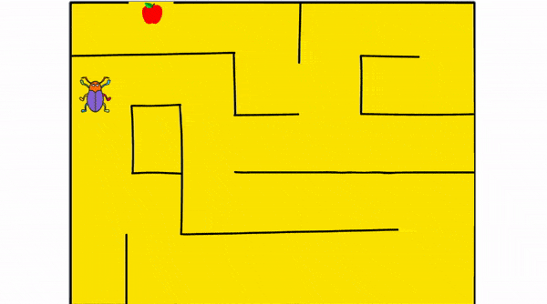

# Pictoblox-scratch-python-Projects
<h2>1. Beetle in the Maze - DIY Maze Game</h2>
 

<h4>To Run this project, Download .sb3 file from given below and open the .sb3 file from Pictoblox software or mobile app</h4>
 
<a href="Beetle in the Maze - DIY Maze Game.sb3">Beetle in the Maze - DIY Maze Game.sb3</a> 

Note:- 
     To move the beetle in the maze Use arrow keys

